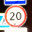
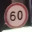

# CarND_Trafic_Sign_Classifier

## Build a Traffic Sign Recognition Project

The goals / steps of this project are the following:

 * Load the data set (see below for links to the project data set)
 * Explore, summarize and visualize the data set
 * Design, train and test a model architecture
 * Use the model to make predictions on new images
 * Analyze the softmax probabilities of the new images
 * Summarize the results with a written report
 
 

## Rubric Points

## Here I will consider the rubric points individually and describe how I addressed each point in my implementation.

### 1. Provide a Writeup / README that includes all the rubric points and how you addressed each one. You can submit your writeup as markdown or pdf. You can use this template as a guide for writing the report. The submission includes the project code.

You are reading it right know, and here is the link: https://github.com/JohanHanssonGithub/CarND_Trafic_Sign_Classifier/tree/master/CarND-Traffic-Sign-Classifier-Project

## Data Set Summary & Exploration
### 1. Provide a basic summary of the data set. In the code, the analysis should be done using python, numpy and/or pandas methods rather than hardcoding results manually.

* Number of training examples = 34799
* Number of testing examples = 12630
* Image data shape = (34799, 32, 32, 3)
* Number of classes = 43

## Design and Test a Model Architecture

### 1. Describe how you preprocessed the image data. What techniques were chosen and why did you choose these techniques? Consider including images showing the output of each preprocessing technique. Pre-processing refers to techniques such as converting to grayscale, normalization, etc. (OPTIONAL: As described in the "Stand Out Suggestions" part of the rubric, if you generated additional data for training, describe why you decided to generate additional data, how you generated the data, and provide example images of the additional data. Then describe the characteristics of the augmented training set like number of images in the set, number of images for each class, etc.)

I belive that the shape was the most importent factor, and if you would use this in a real care lighting would change and effect colour. So the picture were converted to grayscale. I also normolized the pictures Picture=Picture-128/128, this reduced the size of the images. 

### 2. Describe what your final model architecture looks like including model type, layers, layer sizes, connectivity, etc.) Consider including a diagram and/or table describing the final model.

Layer         | Description
------------- | -------------
Input         | 32 x 32 x 1 grayscale
Convolution 1x1 with RELU  | Strides 1 x 1 and padding valid
Maxpooling    | Strides 2 x 2 padding valid
Convolution 1x1 with RELU | Strides 1 x 1 padding valid
Maxpooling    | Strides 2 x 2 padding valid
Fully connected with RELU | 400 to 120 
DropOut | 50% 
Fully connected with RELU | 120 to 84 
DropOut | 50% 
Fully connected with RELU | 84 to 43 

### 3. Describe how you trained your model. The discussion can include the type of optimizer, the batch size, number of epochs and any hyperparameters such as learning rate.

To train the model I used Adam optimizer with a learning rate of 0.00097. With 30 epochs and a batch size of 64 to keep the computanional power needed low. 

### 4. Describe the approach taken for finding a solution and getting the validation set accuracy to be at least 0.93. Include in the discussion the results on the training, validation and test sets and where in the code these were calculated. Your approach may have been an iterative process, in which case, outline the steps you took to get to the final solution and why you chose those steps. Perhaps your solution involved an already well known implementation or architecture. In this case, discuss why you think the architecture is suitable for the current problem.

* Validation accuracy = 0.954
* Test accuracy = 0.935

To get a accuracy of at least 0.93 I implemented the lenet structure, and tried 30  epochs batch size 128 anr learning rate 1. In the beggining I used to few epochs to get good accuracy, but  no mather what I did, i was below 0.93. After a couple of tries, I had to change tactics. So i add two drop out layers, tweaked the batch size and then I made it. 

## Test a Model on New Images

### 1. Choose five German traffic signs found on the web and provide them in the report. For each image, discuss what quality or qualities might be difficult to classify.

The image is bright, the sign is also quit similare to other speed signes. I therefore belive it is going to be hard for the nertwork to predict this one. 

The second image is more distinct and I belive it is going to be easier for the network to predict this one. 

The same as the second image. 

This imange is very similare to alot of other speed signes, so i belive it will be hard to predict this on. 

This image has som similarites to other signes but, i believe there are enough of diffrenses. 

### 2. Discuss the model's predictions on these new traffic signs and compare the results to predicting on the test set. At a minimum, discuss what the predictions were, the accuracy on these new predictions, and compare the accuracy to the accuracy on the test set (OPTIONAL: Discuss the results in more detail as described in the "Stand Out Suggestions" part of the rubric).

Image         | Prediction
------------- | -------------
Speed limit (20km/h)         | Roundabout mandatory
Priority road | Priority road
No entry    | No entry
Speed limit (60km/h)| Speed limit (30km/h)
Go straight or left    | Go straight or left

The model was able to predict 3 of 5, 60 % correct. It failed on the the speed signes as I thought could happen. 

### 3. Describe how certain the model is when predicting on each of the five new images by looking at the softmax probabilities for each prediction. Provide the top 5 softmax probabilities for each image along with the sign type of each probability. (OPTIONAL: as described in the "Stand Out Suggestions" part of the rubric, visualizations can also be provided such as bar charts)
          
          
Image         | Speed limit (80 km/h) | Speed limit (50 km/h) | Speed limit (70 km/h) | Speed limit (120 km/h) | Speed limit (30 km/h) | 
------------- | -------------
Speed limit (60 km/h)         | 0.055| 0.08| 0.150| 0.160| 0.165| 
